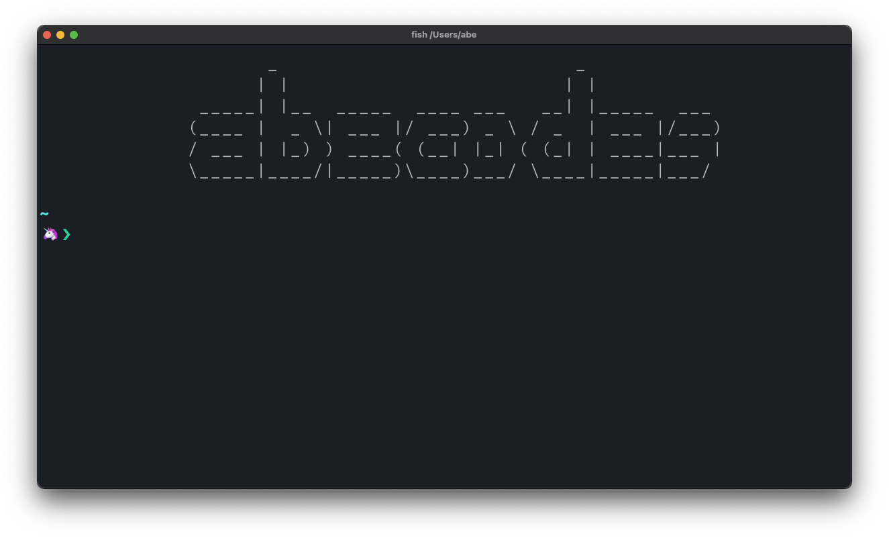

# dotfiles



## :suspect: Overview

To future abe:

Setting up a new system? Messed up the old one again?

> Ah sh!t, here we go again - C.J.

Here are some easy to follow along steps to speed the process up. Maybe you will finally take the time and use some automation for that...

## Prerequisits

**wasiqman**

[wasiqman](https://github.com/qisaw/wasiqman) is a fork of the great [workman layout](https://workmanlayout.org/). It fixes an issue where some ctrl codes are not correctly transmitted to the terminal emulator.

**homebrew**

[Homebrew](https://brew.sh/index) as package manager for macOS.

```bash
/bin/bash -c "$(curl -fsSL https://raw.githubusercontent.com/Homebrew/install/HEAD/install.sh)"

brew analytics off
```

## :see_no_evil: tl;dr

[Docker](https://docs.docker.com/docker-for-mac/install/)

```bash
brew install stow

stow -t ~/ /
```

```bash
brew install neovim neofetch kitty lulu fish jesseduffield/lazygit/lazygit jesseduffield/lazynpm/lazynpm jesseduffield/lazydocker/lazydocker fzf nnn ripgrep go golangci-lint node rustup-init rust-analyzer efm-langserver llvm exa bat mdcat zoxide tealdeer bottom dust sd procs fd tokei jq starship yt-dlp/taps/yt-dlp silicon code-minimap kind kustomize kubectl staticcheck ncdu danvergara/tools/dblab jez/formulae/git-heatmap viu

brew install --cask rectangle mark-text bloomrpc vscodium pritunl librewolf gaphor motrix mongodb-compass

npm i -g eslint_d @fsouza/prettierd vscode-langservers-extracted typescript typescript-language-server https://github.com/jez/bars.git

# packer
git clone https://github.com/wbthomason/packer.nvim ~/.local/share/nvim/site/pack/packer/start/packer.nvim

# kitty themes
https://github.com/dexpota/kitty-themes

# nnn plugins
curl -Ls https://raw.githubusercontent.com/jarun/nnn/master/plugins/getplugs | sh

# additional golang tooling
go install mvdan.cc/gofumpt@latest golang.org/x/tools/go/analysis/passes/shadow/cmd/shadow@latest github.com/securego/gosec/v2/cmd/gosec@latest github.com/fdaines/spm-go@latest github.com/go-critic/go-critic/cmd/gocritic@latest github.com/praetorian-inc/gokart@latest github.com/quasilyte/go-consistent@latest goa.design/model/cmd/mdl@latest github.com/divan/expvarmon@latest github.com/segmentio/golines@latest

# fzf shell bindings
$(brew --prefix)/opt/fzf/install

# fzf vim c-tag support
brew install --HEAD universal-ctags/universal-ctags/universal-ctags

# set default shell
sudo sh -c 'echo /usr/local/bin/fish >> /etc/shells'
chsh -s /usr/local/bin/fish

# For M1 cpus
sudo sh -c 'echo /opt/homebrew/bin/fish >> /etc/shells'
chsh -s /opt/homebrew/bin/fish
```

## :fire: Firewall

It is a firewall, it does firewall stuff. Also, it is open source :thumbsup:

```bash
# lulu https://github.com/objective-see/LuLu
brew install lulu

# little-snitch is a top notch paid alternative
```

## :computer: Shell

Right now I am hooked on [kitty](https://sw.kovidgoyal.net/kitty/#quickstart). Its fast, powerful, highly customizeable and offers everything a great terminal emulater needs.

```bash
brew install kitty

# find themes here
https://github.com/dexpota/kitty-themes
```

[fish](https://fishshell.com/) is my goto shell, but be aware, it is not POSIX compliant and does not support normal bash functions. You may end up rewriting a lot of things to make it work with _fish_.

```bash
brew install fish
```

And of course I want a colorful and fancy prompt :unicorn:

```bash
# starship prompt https://starship.rs
brew install starship
# add to fish conf: starship init fish | source

# colorful terminal motd https://github.com/dylanaraps/neofetch
brew install neofetch
```

Now make **fish** the default shell

```bash
sudo sh -c 'echo /usr/local/bin/fish >> /etc/shells'
chsh -s /usr/local/bin/fish

# For M1 cpus
sudo sh -c 'echo /opt/homebrew/bin/fish >> /etc/shells'
chsh -s /opt/homebrew/bin/fish
```

## :neckbeard: Editor

I like it fast, colorful and extendable, so there is only one choice here: [neovim](https://neovim.io/).

```bash
brew install neovim

# packer to manage nvim plugins, "Plug" would be another option
git clone https://github.com/wbthomason/packer.nvim ~/.local/share/nvim/site/pack/packer/start/packer.nvim
# dont forget to create a session dir for startify in the nvim folder

# If you like your mouse, VS-Code is also a solid choice
[vscodium](https://vscodium.com/) # VS-Code without all the telemetry stuff
brew install --cask vscodium
# By default VS-Codium uses [open-vsx.org](https://open-vsx.org) as plugin marketplace.
# To use the original marketplace overwrite the `product.json`
# /Applications/VSCodium.app/Contents/Resources/app/product.json
# Add:
"extensionsGallery": {
    "serviceUrl": "https://marketplace.visualstudio.com/_apis/public/gallery",
    "cacheUrl": "https://vscode.blob.core.windows.net/gallery/index",
    "itemUrl": "https://marketplace.visualstudio.com/items",
    "controlUrl": "",
    "recommendationsUrl": ""
  }
```

## :zap: Speed up system tools

The rise of [rust](https://www.rust-lang.org/) and its recent _adoption_ to the UNIX kernel brings us more and more improved rewrites of system tools. Some of them are great replacements already.

```bash
brew install exa # ls replacement https://github.com/ogham/exa
brew install bat # cat replacement https://github.com/sharkdp/bat
brew install mdcat # cat replacement for md files https://github.com/lunaryorn/mdcat
brew install zoxide # cd replacement https://github.com/ajeetdsouza/zoxide
# add to fish conf zoxide init fish | source
brew install ripgrep # grep replacement https://github.com/BurntSushi/ripgrep
brew install tealdeer # tldr replacement https://github.com/dbrgn/tealdeer
brew install clementtsang/bottom/bottom # top replacement https://github.com/ClementTsang/bottom
brew install dust # du replacement https://github.com/bootandy/dust
brew install sd # sed replacement https://github.com/chmln/sd
brew install procs # ps replacement https://github.com/dalance/procs
brew install fd # find replacement https://github.com/sharkdp/fd
```

## :sparkles: Additional tooling

[stow](https://www.gnu.org/software/stow/) to easily symlinc dotfiles

```bash
brew install stow
```

Thats a good place for some [Docker](https://docs.docker.com/docker-for-mac/install/).

[Rectangle](https://github.com/rxhanson/Rectangle) as snappy window manager:

```bash
brew install --cask rectangle
```

[librewolf](https://librewolf.net/) a secure and privacy focused firefox port

```bash
brew install --cask librewolf
```

[Pritunl-Client](https://client.pritunl.com/) as a client for OPN-VPN:

```bash
brew install --cask pritunl
```

[bloomrpc](https://github.com/bloomrpc/bloomrpc) postman for grpc:

```bash
brew install --cask bloomrpc
```

[Mark-text](https://marktext.app/) as markdown editor

```bash
brew install --cask mark-text
```

[KIND](https://kind.sigs.k8s.io/docs/user/quick-start/) for local k8s development

```bash
brew install kind
```

[kubectl](https://kubernetes.io/docs/tasks/tools/install-kubectl-macos/#install-with-homebrew-on-macos) k8s command-line tool

```bash
brew install kubectl
```

[kustomize](https://kubectl.docs.kubernetes.io/guides/introduction/kustomize/) for customizing k8s resource configuration free from templates and DSLs

```bash
brew install kustomize
```

[gaphor](https://gaphor.org/) to generate visual C4 documentation

```bash
brew install --cask gaphor
```

[motrix](https://motrix.app/) the download manager

```bash
brew install --cask motrix
```

[mongodb-compass](https://www.mongodb.com/try/download/compass) GUI explorer for mongodb

```bash
brew install --cask mongodb-compass
```

Additions to the CLI would be:

```bash
# for comfortable git usage https://github.com/jesseduffield/lazygit
brew install jesseduffield/lazygit/lazygit

# for comfortable docker usage https://github.com/jesseduffield/lazydocker
brew install jesseduffield/lazydocker/lazydocker

# for comfortable package.json usage https://github.com/jesseduffield/lazynpm
brew install jesseduffield/lazynpm/lazynpm

### nnn as terminal file explorer
brew install nnn
# or building from src for backed in icons with nerdfonts
git clone git@github.com:jarun/nnn
cd nnn
make O_NERD=1
# nnn plugins
curl -Ls https://raw.githubusercontent.com/jarun/nnn/master/plugins/getplugs | sh
###

# jq for better JSON handling https://stedolan.github.io/jq/
brew install jq
# JSON gui explorer
go get -u github.com/gulyasm/jsonui

# show lines and types of code in a project https://github.com/XAMPPRocky/tokei
brew install tokei

# fzf as fuzzy searcher, used in some nvim plugins and nnn https://github.com/junegunn/fzf
brew install fzf
# To install useful key bindings and fuzzy completion:
$(brew --prefix)/opt/fzf/install

# youtube-dl fork with some fix and more features [yt-dlp](https://github.com/yt-dlp/yt-dlp)
brew install yt-dlp/taps/yt-dlp

# silicon for screenshots with nvim https://github.com/Aloxaf/silicon
brew install silicon

# code-minimap for minimap in nvim
brew install code-minimap

# ncdu can display leftover files after gitignore or dockerignore is applied
brew install ncdu

# dblab is a gui sql db explorer for the terminal https://github.com/danvergara/dblab
brew install danvergara/tools/dblab

# get a heatmap of files and changes of the current repo https://github.com/jez/git-heatmap
brew install jez/formulae/git-heatmap
npm install -g https://github.com/jez/bars.git

# viu can display images in a kitty terminal
brew install viu
```

## :nerd_face: Programming languages

```bash
# Golang
brew install go
# gopls to use https://github.com/mvdan/gofumpt
go get mvdan.cc/gofumpt
# go tool's shadow to check for shadowed vars in the code
go install golang.org/x/tools/go/analysis/passes/shadow/cmd/shadow@latest
# gosec checks sourcecode for security vulnarabilities
go install github.com/securego/gosec/v2/cmd/gosec@latest
# spm-go rates the instability of the sourcecode
go install github.com/fdaines/spm-go@latest
# gocritic checks sourcode for a lot of issues
go install github.com/go-critic/go-critic/cmd/gocritic@latest
# gokart checks for security issues
go install github.com/praetorian-inc/gokart@latest
# go-consistent helps to keep a consistent style across the codebase
go install github.com/quasilyte/go-consistent@latest
# goa's c4m documentation framework
go install goa.design/model/cmd/mdl@latest
# expvarmon to monitor debug endpoints from terminal
go install github.com/divan/expvarmon@latest
# golines breaks and indents long lines
go install github.com/segmentio/golines@latest
# linter for the Go programming language (https://staticcheck.io/)
brew install staticcheck
# [golangci-lint](https://golangci-lint.run) is a colleltion of go linters and code checkers
brew install golangci-lint
# Rust
# rust-analyzer is needed as lsp for nvim
# llvm is needed for nvim dap debugging
brew install rustup-init rust-analyzer llvm
# Node
brew install node
# take a look into fnm (https://github.com/Schniz/fnm)
# Deno (be awere of some cross over issues with node/deno especially in VS Code)
brew install deno

### LSP Servers and formatters

# efm-langserver (fast lsp, I use it for formatting mainly,
# but I think I can replace vscode-langservers-extracted with it
brew install efm-langserver
# Javascript/Typescript
npm install -g eslint_d @fsouza/prettierd
npm install -g typescript typescript-language-server
# json, html, js, css
npm i -g vscode-langservers-extracted
```

## :scroll: fonts

- `### free ###`
- [nerd-fonts](https://github.com/ryanoasis/nerd-fonts)
- [VictorMono](https://rubjo.github.io/victor-mono/)
- [Recursive](https://www.recursive.design/)
- [Monoid](https://larsenwork.com/monoid/)
- [Lotion](https://font.nina.coffee/)
- `### paid ###`
- [MonoLisa](https://www.monolisa.dev/)
- [Operator](https://www.typography.com/fonts/operator/styles)
- `### lists ###`
- [Font-List](https://coding-fonts.css-tricks.com/)
- [Font-List 2](https://www.programmingfonts.org/)

## :white_check_mark: todo
